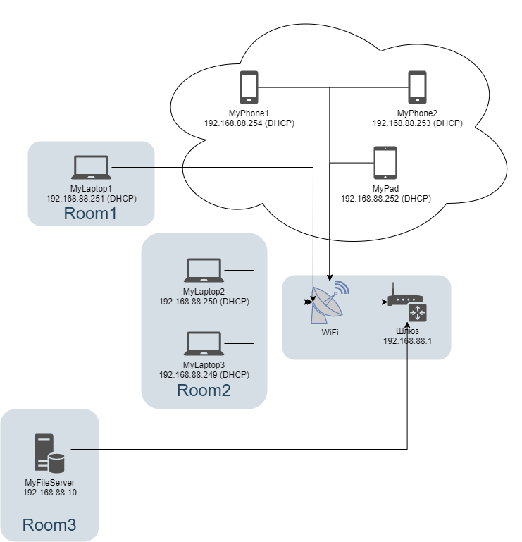

### 1. 

 

route-views>show ip route 188.162.64.143 

                Routing entry for 188.162.64.0/23
                  Known via "bgp 6447", distance 20, metric 0
                  Tag 3356, type external
                  Last update from 4.68.4.46 01:18:07 ago
                  Routing Descriptor Blocks:
                  * 4.68.4.46, from 4.68.4.46, 01:18:07 ago
                      Route metric is 0, traffic share count is 1
                      AS Hops 3
                      Route tag 3356
                      MPLS label: none

 

 

route-views>show bgp 188.162.64.143

                BGP routing table entry for 188.162.64.0/23, version 1855761538
                Paths: (23 available, best #10, table default)
                  Not advertised to any peer
                  Refresh Epoch 1
                  20912 3257 3356 31133 31213
                    212.66.96.126 from 212.66.96.126 (212.66.96.126)
                      Origin IGP, localpref 100, valid, external
                      Community: 3257:8070 3257:30515 3257:50001 3257:53900 3257:53902 20912:65004
                      path 7FE045A84380 RPKI State valid
                      rx pathid: 0, tx pathid: 0
                  Refresh Epoch 1
                  3333 31133 31213
                    193.0.0.56 from 193.0.0.56 (193.0.0.56)
                      Origin IGP, localpref 100, valid, external
                      path 7FE13A717708 RPKI State valid
                      rx pathid: 0, tx pathid: 0
                  Refresh Epoch 1
                  8283 31133 31213
                    94.142.247.3 from 94.142.247.3 (94.142.247.3)
                      Origin IGP, metric 0, localpref 100, valid, external
                      Community: 8283:1 8283:101 8283:103
                      unknown transitive attribute: flag 0xE0 type 0x20 length 0x24
                        value 0000 205B 0000 0000 0000 0001 0000 205B
                              0000 0005 0000 0001 0000 205B 0000 0005
                              0000 0003
                      path 7FE012301360 RPKI State valid
                      rx pathid: 0, tx pathid: 0
                  Refresh Epoch 1
                  6939 31133 31213
                    64.71.137.241 from 64.71.137.241 (216.218.252.164)
                      Origin IGP, localpref 100, valid, external
                      path 7FE16ED31FD0 RPKI State valid
                      rx pathid: 0, tx pathid: 0
                  Refresh Epoch 1
                  53767 14315 6453 6453 3356 31133 31213
                    162.251.163.2 from 162.251.163.2 (162.251.162.3)
                      Origin IGP, localpref 100, valid, external
                      Community: 14315:5000 53767:5000
                      path 7FE03B8976F0 RPKI State valid
                      rx pathid: 0, tx pathid: 0
                  Refresh Epoch 1
                  101 11164 2603 31133 31213
                    209.124.176.223 from 209.124.176.223 (209.124.176.223)
                      Origin IGP, localpref 100, valid, external
                      Community: 0:714 0:2854 0:3216 0:5580 0:6461 0:6939 0:8075 0:8359 0:9002 0:12389 0:12876 0:12989 0:13335 0:15169 0:16265 0:16276 0:16302 0:16509 0:16625 0:20485 0:20764 0:20940 0:21859 0:22697 0:24940 0:32338 0:32590 0:33438 0:33891 0:39832 0:42668 0:46489 0:47541 0:47542 0:49544 0:49981 0:56550 0:56630 0:57976 0:60280 101:20100 101:22100 2603:302 2603:666 2603:65101 11164:1170 11164:7880
                      Extended Community: RT:101:22100
                      path 7FE0872CDCC0 RPKI State valid
                      rx pathid: 0, tx pathid: 0
                  Refresh Epoch 1
                  20130 6939 31133 31213
                    140.192.8.16 from 140.192.8.16 (140.192.8.16)
                      Origin IGP, localpref 100, valid, external
                      path 7FE0CEADF4E0 RPKI State valid
                      rx pathid: 0, tx pathid: 0
                  Refresh Epoch 1
                  3549 3356 31133 31213
                    208.51.134.254 from 208.51.134.254 (67.16.168.191)
                      Origin IGP, metric 0, localpref 100, valid, external
                      Community: 3356:2 3356:22 3356:100 3356:123 3356:519 3356:901 3356:2094 3549:2581 3549:30840
                      path 7FE1444545D0 RPKI State valid
                      rx pathid: 0, tx pathid: 0
                  Refresh Epoch 1
                  57866 3356 31133 31213
                    37.139.139.17 from 37.139.139.17 (37.139.139.17)
                      Origin IGP, metric 0, localpref 100, valid, external
                      Community: 3356:2 3356:22 3356:100 3356:123 3356:519 3356:901 3356:2094 65001:1299
                      path 7FE04B307B00 RPKI State valid
                      rx pathid: 0, tx pathid: 0
                  Refresh Epoch 1
                  3356 31133 31213
                    4.68.4.46 from 4.68.4.46 (4.69.184.201)
                      Origin IGP, metric 0, localpref 100, valid, external, best
                      Community: 3356:2 3356:22 3356:100 3356:123 3356:519 3356:901 3356:2094 65001:1299
                      path 7FE114B46270 RPKI State valid
                      rx pathid: 0, tx pathid: 0x0
                  Refresh Epoch 1
                  852 31133 31213
                    154.11.12.212 from 154.11.12.212 (96.1.209.43)
                      Origin IGP, metric 0, localpref 100, valid, external
                      path 7FE0C3F83998 RPKI State valid
                      rx pathid: 0, tx pathid: 0
                  Refresh Epoch 1
                  2497 3356 31133 31213
                    202.232.0.2 from 202.232.0.2 (58.138.96.254)
                      Origin IGP, localpref 100, valid, external
                      path 7FE0EECF88F8 RPKI State valid
                      rx pathid: 0, tx pathid: 0
                  Refresh Epoch 3
                  3303 31133 31213
                    217.192.89.50 from 217.192.89.50 (138.187.128.158)
                      Origin IGP, localpref 100, valid, external
                      Community: 3303:1004 3303:1006 3303:1030 3303:1031 3303:3056 65101:1085 65102:1000 65103:276 65104:150
                      path 7FE11C03EAF8 RPKI State valid
                      rx pathid: 0, tx pathid: 0
                  Refresh Epoch 1
                  4901 6079 31133 31213
                    162.250.137.254 from 162.250.137.254 (162.250.137.254)
                      Origin IGP, localpref 100, valid, external
                      Community: 65000:10100 65000:10300 65000:10400
                      path 7FE09904D608 RPKI State valid
                      rx pathid: 0, tx pathid: 0
                  Refresh Epoch 1
                  7660 2516 1299 31133 31213
                    203.181.248.168 from 203.181.248.168 (203.181.248.168)
                      Origin IGP, localpref 100, valid, external
                      Community: 2516:1030 7660:9001
                      path 7FE15A9D87E8 RPKI State valid
                      rx pathid: 0, tx pathid: 0
                  Refresh Epoch 1
                  7018 1299 31133 31213
                    12.0.1.63 from 12.0.1.63 (12.0.1.63)
                      Origin IGP, localpref 100, valid, external
                      Community: 7018:5000 7018:37232
                      path 7FE149990CB0 RPKI State valid
                      rx pathid: 0, tx pathid: 0
                  Refresh Epoch 1
                  49788 12552 31133 31213
                    91.218.184.60 from 91.218.184.60 (91.218.184.60)
                      Origin IGP, localpref 100, valid, external
                      Community: 12552:12000 12552:12100 12552:12101 12552:22000
                      Extended Community: 0x43:100:1
                      path 7FE0AD82C360 RPKI State valid
                      rx pathid: 0, tx pathid: 0
                  Refresh Epoch 1
                  1221 4637 31133 31213
                    203.62.252.83 from 203.62.252.83 (203.62.252.83)
                      Origin IGP, localpref 100, valid, external
                      path 7FE1118B7638 RPKI State valid
                      rx pathid: 0, tx pathid: 0
                  Refresh Epoch 1
                  701 3356 31133 31213
                    137.39.3.55 from 137.39.3.55 (137.39.3.55)
                      Origin IGP, localpref 100, valid, external
                      path 7FE0D363C298 RPKI State valid
                      rx pathid: 0, tx pathid: 0
                  Refresh Epoch 1
                  3257 3356 31133 31213
                    89.149.178.10 from 89.149.178.10 (213.200.83.26)
                      Origin IGP, metric 10, localpref 100, valid, external
                      Community: 3257:8794 3257:30043 3257:50001 3257:54900 3257:54901
                      path 7FE102893848 RPKI State valid
                      rx pathid: 0, tx pathid: 0
                  Refresh Epoch 1
                  1351 6939 31133 31213
                    132.198.255.253 from 132.198.255.253 (132.198.255.253)
                      Origin IGP, localpref 100, valid, external
                      path 7FE13A818AA8 RPKI State valid
                      rx pathid: 0, tx pathid: 0
                  Refresh Epoch 1
                  19214 3257 3356 31133 31213
                    208.74.64.40 from 208.74.64.40 (208.74.64.40)
                      Origin IGP, localpref 100, valid, external
                      Community: 3257:8108 3257:30048 3257:50002 3257:51200 3257:51203
                      path 7FE0F810AD28 RPKI State valid
                      rx pathid: 0, tx pathid: 0
                  Refresh Epoch 1
                  3561 3910 3356 31133 31213
                    206.24.210.80 from 206.24.210.80 (206.24.210.80)
                      Origin IGP, localpref 100, valid, external
                      path 7FE01B3EF4D8 RPKI State valid
                      rx pathid: 0, tx pathid: 0

 

### 2.  
Активируем модуль dummy`sudo nano /etc/modules` --> `dummy` 
Прописываем опцию для dummy `sudo nano /etc/modprobe.d/dummy.conf` --> `option dummy numdumies=2"` 

 

Вносим интерфейс dummy0 `sudo nano /etc/network/interfaces` и сразу прописываем маршрут

                # interfaces(5) file used by ifup(8) and ifdown(8)
                # Include files from /etc/network/interfaces.d:
                source-directory /etc/network/interfaces.d

                auto dummy0
                iface dummy0 inet static
                        adress 10.2.2.2/32
                        pre-up ip link add dummy0 type dummy
                        post-up ip route add 192.168.111.0/24 dev dummy0
                        post-down ip link del dummy0

Проверим интерфейс `ip a`
                 
                3: dummy0: <BROADCAST,NOARP,UP,LOWER_UP> mtu 1500 qdisc noqueue state UNKNOWN group default qlen 1000
                    link/ether 12:32:9d:b4:7b:78 brd ff:ff:ff:ff:ff:ff
                    inet 10.2.2.2/32 brd 10.2.2.2 scope global dummy0
                       valid_lft forever preferred_lft forever
                    inet6 fe80::1032:9dff:feb4:7b78/64 scope link
                       valid_lft forever preferred_lft forever

Проверим маршрут `route`
                 
                Kernel IP routing table
                Destination     Gateway         Genmask         Flags Metric Ref    Use Iface
                default         _gateway        0.0.0.0         UG    100    0        0 eth0
                10.0.2.0        0.0.0.0         255.255.255.0   U     0      0        0 eth0
                _gateway        0.0.0.0         255.255.255.255 UH    100    0        0 eth0
                192.168.111.0   0.0.0.0         255.255.255.0   U     0      0        0 dummy0

### 3.
Команда `sudo ss -tnlp`

                State    Recv-Q   Send-Q     Local Address:Port      Peer Address:Port   Process
                LISTEN   0        4096             0.0.0.0:111            0.0.0.0:*       users:(("rpcbind",pid=598,fd=4),("systemd",pid=1,fd=35))
                LISTEN   0        511              0.0.0.0:80             0.0.0.0:*       users:(("nginx",pid=726,fd=6),("nginx",pid=725,fd=6),("nginx",pid=724,fd=6))
                LISTEN   0        4096       127.0.0.53%lo:53             0.0.0.0:*       users:(("systemd-resolve",pid=599,fd=13))
                LISTEN   0        128              0.0.0.0:22             0.0.0.0:*       users:(("sshd",pid=791,fd=3))
                LISTEN   0        4096                [::]:111               [::]:*       users:(("rpcbind",pid=598,fd=6),("systemd",pid=1,fd=37))
                LISTEN   0        50                     *:8080                 *:*       users:(("java",pid=951,fd=119))
                LISTEN   0        511                 [::]:80                [::]:*       users:(("nginx",pid=726,fd=7),("nginx",pid=725,fd=7),("nginx",pid=724,fd=7))
                LISTEN   0        128                 [::]:22                [::]:*       users:(("sshd",pid=791,fd=4))

Тут мы можем увидеть сервер **nginx** работающий на **80** порт

### 4. 
Команда `sudo ss -unlp`

                State      Recv-Q     Send-Q            Local Address:Port           Peer Address:Port     Process
                UNCONN     0          0                 127.0.0.53%lo:53                  0.0.0.0:*         users:(("systemd-resolve",pid=599,fd=12))
                UNCONN     0          0                10.0.2.15%eth0:68                  0.0.0.0:*         users:(("systemd-network",pid=405,fd=19))
                UNCONN     0          0                       0.0.0.0:111                 0.0.0.0:*         users:(("rpcbind",pid=598,fd=5),("systemd",pid=1,fd=36))
                UNCONN     0          0                     127.0.0.1:161                 0.0.0.0:*         users:(("snmpd",pid=710,fd=6))
                UNCONN     0          0                          [::]:111                    [::]:*         users:(("rpcbind",pid=598,fd=7),("systemd",pid=1,fd=38))
                UNCONN     0          0                         [::1]:161                    [::]:*         users:(("snmpd",pid=710,fd=7))

***systemd-resolve*** он же распознователь DNS слушает *53* порт. 

### 5. 

