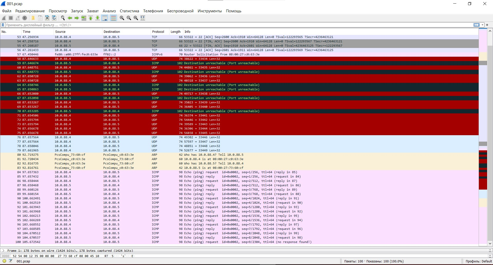

1. Зарегистрировался в приложении и создал пароль

2. Включил двухфакторную аутентификацию. Подключил Google Authenticator. 

3. Ставим apache2
                
                sudo apt install apache2
                sudo a2enmod ssl
                sudo systemctl restart apache2

Генерим серт

                sudo openssl req -x509 -nodes -days 36500 -newkey rsa:2048 -keyout /etc/ssl/private/apache-ssc.key -out /etc/ssl/certs/apache-ssc.crt -subj "/C=RU/ST=SPb/L=SPb/O=DevCo/OU=Org/CN=dev1.local/CN=test"

Прописываем серт

                sudo nano /etc/apache2/sites-available/dev1.local.conf

                <VirtualHost *:443>
                   ServerName dev1.local
                   DocumentRoot /var/www/dev1.local
                   SSLEngine on
                   SSLCertificateFile /etc/ssl/certs/apache-ssc.crt
                   SSLCertificateKeyFile /etc/ssl/private/apache-ssc.key
                </VirtualHost>

Создаём домашнюю страницу

                sudo mkdir /var/www/dev1.local
                nano /var/www/dev1.local/index.html

                <h1>it worked!</h1>

Применяем изменения 

                sudo a2ensite dev1.local.conf
                sudo apache2ctl configtest
                sudo systemctl reload apache2

4. Проверка сайта

 

vagrant@vagrant:~/testssl.sh$ ./testssl.sh -e --fast --parallel https://сайт.домен

                ###########################################################
                    testssl.sh       3.1dev from https://testssl.sh/dev/
                    (35ddd91 2021-12-21 10:54:58 -- )

                      This program is free software. Distribution and
                             modification under GPLv2 permitted.
                      USAGE w/o ANY WARRANTY. USE IT AT YOUR OWN RISK!

                       Please file bugs @ https://testssl.sh/bugs/

                ###########################################################

                 Using "OpenSSL 1.0.2-chacha (1.0.2k-dev)" [~183 ciphers]
                 on vagrant:./bin/openssl.Linux.x86_64
                 (built: "Jan 18 17:12:17 2019", platform: "linux-x86_64")

                 Start 2021-12-21 19:18:52        -->> ip.ip.ip.ip:443 (https://сайт.домен) <<--

                 rDNS (77.222.61.31):    vh279.sweb.ru.
                 Service detected:       HTTP

                 Testing all 183 locally available ciphers against the server, ordered by encryption strength

                Hexcode  Cipher Suite Name (OpenSSL)       KeyExch.   Encryption  Bits     Cipher Suite Name (IANA/RFC)
                -----------------------------------------------------------------------------------------------------------------------------
                 xc030   ECDHE-RSA-AES256-GCM-SHA384       ECDH 256   AESGCM      256      TLS_ECDHE_RSA_WITH_AES_256_GCM_SHA384
                 xc028   ECDHE-RSA-AES256-SHA384           ECDH 256   AES         256      TLS_ECDHE_RSA_WITH_AES_256_CBC_SHA384
                 xc014   ECDHE-RSA-AES256-SHA              ECDH 256   AES         256      TLS_ECDHE_RSA_WITH_AES_256_CBC_SHA
                 x9f     DHE-RSA-AES256-GCM-SHA384         DH 2048    AESGCM      256      TLS_DHE_RSA_WITH_AES_256_GCM_SHA384
                 x6b     DHE-RSA-AES256-SHA256             DH 2048    AES         256      TLS_DHE_RSA_WITH_AES_256_CBC_SHA256
                 x39     DHE-RSA-AES256-SHA                DH 2048    AES         256      TLS_DHE_RSA_WITH_AES_256_CBC_SHA
                 x88     DHE-RSA-CAMELLIA256-SHA           DH 2048    Camellia    256      TLS_DHE_RSA_WITH_CAMELLIA_256_CBC_SHA
                 x9d     AES256-GCM-SHA384                 RSA        AESGCM      256      TLS_RSA_WITH_AES_256_GCM_SHA384
                 x3d     AES256-SHA256                     RSA        AES         256      TLS_RSA_WITH_AES_256_CBC_SHA256
                 x35     AES256-SHA                        RSA        AES         256      TLS_RSA_WITH_AES_256_CBC_SHA
                 x84     CAMELLIA256-SHA                   RSA        Camellia    256      TLS_RSA_WITH_CAMELLIA_256_CBC_SHA
                 xc02f   ECDHE-RSA-AES128-GCM-SHA256       ECDH 256   AESGCM      128      TLS_ECDHE_RSA_WITH_AES_128_GCM_SHA256
                 xc027   ECDHE-RSA-AES128-SHA256           ECDH 256   AES         128      TLS_ECDHE_RSA_WITH_AES_128_CBC_SHA256
                 xc013   ECDHE-RSA-AES128-SHA              ECDH 256   AES         128      TLS_ECDHE_RSA_WITH_AES_128_CBC_SHA
                 x9e     DHE-RSA-AES128-GCM-SHA256         DH 2048    AESGCM      128      TLS_DHE_RSA_WITH_AES_128_GCM_SHA256
                 x67     DHE-RSA-AES128-SHA256             DH 2048    AES         128      TLS_DHE_RSA_WITH_AES_128_CBC_SHA256
                 x33     DHE-RSA-AES128-SHA                DH 2048    AES         128      TLS_DHE_RSA_WITH_AES_128_CBC_SHA
                 x45     DHE-RSA-CAMELLIA128-SHA           DH 2048    Camellia    128      TLS_DHE_RSA_WITH_CAMELLIA_128_CBC_SHA
                 x9c     AES128-GCM-SHA256                 RSA        AESGCM      128      TLS_RSA_WITH_AES_128_GCM_SHA256
                 x3c     AES128-SHA256                     RSA        AES         128      TLS_RSA_WITH_AES_128_CBC_SHA256
                 x2f     AES128-SHA                        RSA        AES         128      TLS_RSA_WITH_AES_128_CBC_SHA
                 x41     CAMELLIA128-SHA                   RSA        Camellia    128      TLS_RSA_WITH_CAMELLIA_128_CBC_SHA

                 Done 2021-12-21 19:19:02 [  12s] -->> ip.ip.ip.ip:443 (сайт.домен) <<--

 

vagrant@vagrant:~/testssl.sh$ ./testssl.sh -U --sneaky https://сайт.домен/

                ###########################################################
                    testssl.sh       3.1dev from https://testssl.sh/dev/
                    (35ddd91 2021-12-21 10:54:58 -- )

                      This program is free software. Distribution and
                             modification under GPLv2 permitted.
                      USAGE w/o ANY WARRANTY. USE IT AT YOUR OWN RISK!

                       Please file bugs @ https://testssl.sh/bugs/

                ###########################################################

                 Using "OpenSSL 1.0.2-chacha (1.0.2k-dev)" [~183 ciphers]
                 on vagrant:./bin/openssl.Linux.x86_64
                 (built: "Jan 18 17:12:17 2019", platform: "linux-x86_64")

                 Start 2021-12-21 19:19:36        -->> ip.ip.ip.ip:443 (сайт.домен) <<--

                 rDNS (ip.ip.ip.ip):    vh279.sweb.ru.
                 Service detected:       HTTP

                 Testing vulnerabilities

                 Heartbleed (CVE-2014-0160)                not vulnerable (OK), timed out
                 CCS (CVE-2014-0224)                       not vulnerable (OK)
                 Ticketbleed (CVE-2016-9244), experiment.  not vulnerable (OK)
                 ROBOT                                     not vulnerable (OK)
                 Secure Renegotiation (RFC 5746)           supported (OK)
                 Secure Client-Initiated Renegotiation     not vulnerable (OK)
                 CRIME, TLS (CVE-2012-4929)                not vulnerable (OK)
                 BREACH (CVE-2013-3587)                    potentially NOT ok, "gzip" HTTP compression detected. - only supplied "/" tested
                                                           Can be ignored for static pages or if no secrets in the page
                 POODLE, SSL (CVE-2014-3566)               not vulnerable (OK)
                 TLS_FALLBACK_SCSV (RFC 7507)              Downgrade attack prevention supported (OK)
                 SWEET32 (CVE-2016-2183, CVE-2016-6329)    not vulnerable (OK)
                 FREAK (CVE-2015-0204)                     not vulnerable (OK)
                 DROWN (CVE-2016-0800, CVE-2016-0703)      not vulnerable on this host and port (OK)
                                                           make sure you don't use this certificate elsewhere with SSLv2 enabled services
                                                           https://censys.io/ipv4?q=AFC9E65E021CC6EAFDA6F3FDCC5BF030219AAF5E090B5ECF139CA6C152C9BFEC could help you to find out
                 LOGJAM (CVE-2015-4000), experimental      not vulnerable (OK): no DH EXPORT ciphers, no common prime detected
                 BEAST (CVE-2011-3389)                     TLS1: ECDHE-RSA-AES256-SHA DHE-RSA-AES256-SHA ECDHE-RSA-AES128-SHA DHE-RSA-AES128-SHA AES256-SHA AES128-SHA
                                                                 DHE-RSA-CAMELLIA256-SHA CAMELLIA256-SHA DHE-RSA-CAMELLIA128-SHA CAMELLIA128-SHA
                                                           VULNERABLE -- but also supports higher protocols  TLSv1.1 TLSv1.2 (likely mitigated)
                 LUCKY13 (CVE-2013-0169), experimental     potentially VULNERABLE, uses cipher block chaining (CBC) ciphers with TLS. Check patches
                 Winshock (CVE-2014-6321), experimental    not vulnerable (OK) - CAMELLIA or ECDHE_RSA GCM ciphers found
                 RC4 (CVE-2013-2566, CVE-2015-2808)        no RC4 ciphers detected (OK)

                 Done 2021-12-21 19:20:31 [  57s] 

5. 
 установка sshd сервер
 аapt install openssh-server
 systemctl start sshd.service
 systemctl enable sshd.service
 генерим ключ
 ssh-keygen
копируем публичный ключ на удаленный сервер
ssh-copy-id user@10.0.88.5
подключаемся по стандартному ключу
ssh user@10.0.88.5
Проверяем ключ Ssh
ssh-audit localhostlhost

6. В папке ~/.ssh создаем файл config, чтобы задать hostname

Hostname vagrant 
Host 10.0.88.5
Port 2007
User user
IdentityFile ~/.ssh/id_rsa
BatchMode yes

7.
                tcpdump -c 100 -w 1.pcap
                tcpdump: listening on eth0, link-type EN10MB (Ethernet), capture size 262144 bytes
                100 packets captured
