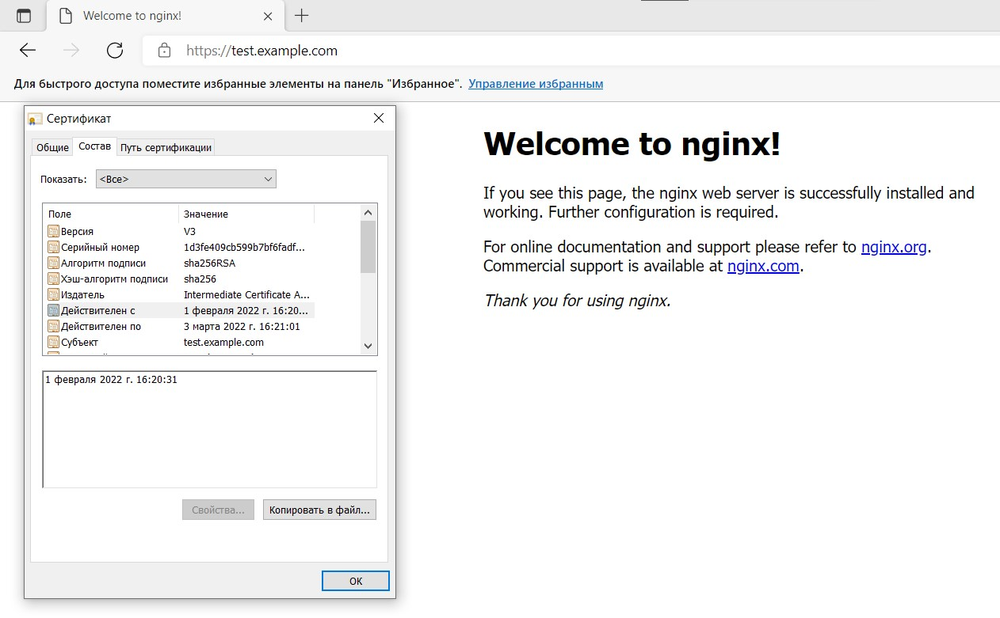

UFW уже предустановлен, однако sudo apt install ufw для установки и sudo ufw enable для включения

Открытие портов 
```

sudo ufw allow 443/tcp
sudo ufw allow 80/tcp
sudo ufw allow 22/tcp

```

установка vault

```
curl -fsSL https://apt.releases.hashicorp.com/gpg | sudo apt-key add -

sudo apt-add-repository "deb [arch=amd64] https://apt.releases.hashicorp.com $(lsb_release -cs) main"

$ sudo apt-get update && sudo apt-get install vault

```

Запускаем сервер vault
```

vault server -dev -dev-root-token-id root

```
В другом окне вводим 
```

export VAULT_ADDR=http://127.0.0.1:8200
export VAULT_TOKEN=root
```


<summary>Создаём скрипт CAscript.sh для генерации сертификатов и экспорта в формат KEY и запускаем его</summary><details>

```

#!/bin/bash

ca_url="https://example.com"

# enable Vault PKI secret
vault secrets enable \
  -path=pki_root_ca \
  -description="PKI Root CA" \
  -max-lease-ttl="262800h" \
  pki

# generate root CA
vault write -format=json pki_root_ca/root/generate/internal \
  common_name="Root Certificate Authority" \
  ttl="262800h" > pki-root-ca.json

# save the certificate
cat pki-root-ca.json | jq -r .data.certificate > rootCA.pem

# publish urls for the root ca
vault write pki_root_ca/config/urls \
  issuing_certificates="$ca_url/v1/pki_root_ca/ca" \
  crl_distribution_points="$ca_url/v1/pki_root_ca/crl"

# enable Vault PKI secret
vault secrets enable \
  -path=pki_int_ca \
  -description="PKI Intermediate CA" \
  -max-lease-ttl="175200h" \
  pki

# create intermediate CA with common name example.com and save the CSR
vault write -format=json pki_int_ca/intermediate/generate/internal \
  common_name="Intermediate Certificate Authority" \
  ttl="175200h" | jq -r '.data.csr' > pki_intermediate_ca.csr

# send the intermediate CA's CSR to the root CA
vault write -format=json pki_root_ca/root/sign-intermediate csr=@pki_intermediate_ca.csr \
  format=pem_bundle \
  ttl="175200h" | jq -r '.data.certificate' > intermediateCA.cert.pem

# publish the signed certificate back to the Intermediate CA
vault write pki_int_ca/intermediate/set-signed \
  certificate=@intermediateCA.cert.pem

# publish the intermediate CA urls ???
vault write pki_int_ca/config/urls \
  issuing_certificates="$ca_url/v1/pki_int_ca/ca" \
  crl_distribution_points="$ca_url/v1/pki_int_ca/crl"

# create a role test-dot-local-server
vault write pki_int_ca/roles/test-dot-local-server \
  allowed_domains="example.com" \
  allow_subdomains=true \
  max_ttl="87600h" \
  key_bits="2048" \
  key_type="rsa" \
  key_usage="DigitalSignature,KeyEncipherment" \
  ext_key_usage="ServerAuth" \
  require_cn=true

# create a role test-dot-local-client
vault write pki_int_ca/roles/test-dot-local-client \
  allow_subdomains=true \
  max_ttl="87600h" \
  key_bits="2048" \
  key_type="rsa" \
  key_usage="DigitalSignature" \
  ext_key_usage="ClientAuth" \
  require_cn=true

# Create cert, 1 month(720 hours)
vault write -format=json pki_int_ca/issue/test-dot-local-server \
  common_name="test.example.com" \
  alt_names="test.example.com" \
  ttl="720h" > test.example.com.crt

# save cert
cat test.example.com.crt | jq -r .data.certificate > test.example.com.pem
cat test.example.com.crt | jq -r .data.issuing_ca >> test.example.com.pem
cat test.example.com.crt | jq -r .data.private_key > test.example.com.key

```
</details>


***
Начинаем работать с nginx
Устанавливаем nginx в систему
```
Sudo apt install nginx
```
Проверим работу сервера
 <summary>systemctl status nginx</summary><details>

 ```
● nginx.service - A high performance web server and a reverse proxy server
     Loaded: loaded (/lib/systemd/system/nginx.service; enabled; vendor preset: enabled)
     Active: active (running) since Sat 2022-01-29 00:03:08 MSK; 16min ago
       Docs: man:nginx(8)
    Process: 2746 ExecStartPre=/usr/sbin/nginx -t -q -g daemon on; master_process on; (code=exited, status=0/SUCCESS)
    Process: 2747 ExecStart=/usr/sbin/nginx -g daemon on; master_process on; (code=exited, status=0/SUCCESS)
   Main PID: 2836 (nginx)
      Tasks: 2 (limit: 1085)
     Memory: 4.0M
     CGroup: /system.slice/nginx.service
             ├─2836 nginx: master process /usr/sbin/nginx -g daemon on; master_process on;
             └─2839 nginx: worker process

янв 29 00:03:08 kurs systemd[1]: Starting A high performance web server and a reverse proxy server...
янв 29 00:03:08 kurs systemd[1]: Started A high performance web server and a reverse proxy server.
```
</details>

Проверим доступность сервера с физической машины. Ранее открывались доступы на ufw, поэтому просто переходим по ссылки и попадаем на стартовую страницу nginx.
Прописываем в конфигурацию нашего сервера (/etc/nginx/nginx.conf) в строки для SSL и прописываем пути 
```
server {
    listen              443 ssl;
    server_name         www.example.com;
    ssl_certificate     /home/hello/test.example.com.pem;
    ssl_certificate_key /home/hello/test.example.com.key;
    ssl_protocols       TLSv1 TLSv1.1 TLSv1.2;
    ssl_ciphers         HIGH:!aNULL:!MD5;
    }

```
Перезапускаем сервер 
         systemctl restart nginx

На машине хосте заходим на сайт https://test.example.com


<summary>Создадим скрипт CA_Rescript.sh для перерегистрации сертификата</summary>
<details>

```
vault secrets enable \
	-path=pki_int_ca \
	-description="PKI Intermediate CA" \
	-max-lease-ttl="175200h"

vault write pki_int_ca/roles/test-dot-local-client \
	max_ttl="87600h" \
	allow_subdomains=true

vault write -format=json pki_int_ca/issue/test-dot-local-server \
	common_name="test.example.com" \
	alt_names="test.example.com" \
	ttl="720" > test.example.com.crt

cat test.example.com.crt | jq -r .data.certificate > test.example.com.pem
cat test.example.com.crt | jq -r .data.issuing_ca >> test.example.com.pem
cat test.example.com.crt | jq -r .data.private_key >> test.example.com.pem
cat test.example.com.crt | jq -r .data.private_key > test.example.com.key

nginx -s reload

```
</details>

Теперь запишем наш скрипт в crontab
```
 crontab -e

USER=hello
VAULT_TOKEN=root
VAULT_ADDR=http://127.0.0.1:8200

20 16 1 * * /home/hello/CA_Rescript.sh  >> /home/hello/Rescript.log 2>&1

```
По планировщику каждый месяц 1 числа в 16:20 будет сгенерирован новый сертификат. Ждём 16:20 и проверяем сервер



